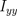

# *Task 3: Feature Extraction and Matching*

## **1\. Introduction**

---

## **2\. Harris operator and Lambda**

The purpose of this section is to demonstrate our implementation of the corner detection algorithm using both the Harris operator, and the Eigen values and vectors of the change matrix, as well as display some of our results for both algorithms.

### Algorithm

The feature detection algorithm that we implemented detects keypoints, points in the image that correspond to “corners”. It simulates a window being scanned, and for every point in the image, the distance is calculated as ssd between the window centered at this point, and the window centered at another point shifted in both x and y directions, and detects a corner if the change is too large in both directions.

Formally what's being implemented is as follows:

1. The gradient of the image is calculated in both directions.  
2. The gradient matrices are then operated on to output: ,  and .  
3. These results are then smoothed using a gaussian filter to simulate the effect of the “window”.  
4. Then for each pixel in the image, the change matrix is populated with \[ \], \[ \]  
5. The value to be compared, Harris operator or lambda negative, is calculated from this matrix.   
   1. Harris \= det(matrix) \- 0.04 \* trace(matrix) \*\* 2  
   2. Lambda negative is the minimum eigenvalue of the matrix  
6. THresholding is then applied on the results using the values distribution, to obtain only strong corners.  
7. A non-max suppression algorithm is run on each detected corner, to further filter the results, leaving only the peaks of each detected edge.

### Demonstration

Example Image:  
 

Gradients:  
  

Harris operator before thresholding:  

Lambda negative before thresholding:  

Histogram of harris and  lambda \-ve values:  

  
  

Harris and Lambda after thresholding:

  
  

Corners after non-max suppression:  

  
  

---

## **3\. SIFT**

This section shows the output and the work done in the creation of keypionts and making them rotation and scaling invariant 

We used multiple sources to generate this code from original algorithm proposed by David G. Lowe, github repo for the full functionality, openCV implementation and [Anatomy of the SIFT Method](https://www.ipol.im/pub/art/2014/82/article.pdf). The implementation returns OpenCV `KeyPoint` objects and descriptors

## **Key Components**

We Used a combination of the 4 approaches to implement this task

### **1\. Scale-Space Construction**

* **Gaussian Pyramid**: it constructs a series of images with progressively increased Gaussian blur. This is achieved by applying Gaussian filters with different sigma values to the input image.

* **Difference of Gaussians (DoG)**: Adjacent images in the Gaussian pyramid are subtracted to produce DoG images, which approximate the Laplacian of Gaussian and help in detecting scale-invariant features.

### **2\. Keypoint Detection**

* **Extrema Detection**: we search for local extrema (maxima and minima) in the DoG images by comparing each pixel to its 26 neighbors in 3D (x, y, scale) space.

* **Keypoint Localization**: Detected extrema are refined to sub-pixel accuracy using Taylor expansion. Keypoints with low contrast or poorly localized along edges are discarded.

### **3\. Orientation Assignment**

* For each keypoint, it computes the gradient magnitude and orientation in a neighborhood around the keypoint. A histogram of orientations is created, and the dominant orientation(s) are assigned to the keypoint, ensuring rotation invariance.

### **4\. Descriptor Generation**

* The algorithm constructs a descriptor for each keypoint by computing the gradient magnitude and orientation in a region around the keypoint. This region is divided into sub-regions, and orientation histograms are computed for each. The concatenated histograms form a 128-dimensional vector, which is normalized to enhance robustness to illumination changes.

### **5\. Compared to Built-in**
 

### **6\.Output Duration**

	It depends on the image size but on average it takes between 10 seconds to 1 minute according to size as we mainly add more octaves for bigger images

## **Structure**

* **`extractKeypointsAndDescriptors(image)`**: Main function that calls all functions in it, returning keypoints and their descriptors.

* **`generateBaseImage(image)`**: Prepares the initial image by upsampling and applying Gaussian blur.  
  

* **`generateGaussianKernels & GenerateGaussianImages`**: Constructs the Gaussian pyramid.  
    
    
  

   
* **`buildDoGPyramid(gaussian_pyramid)`**: Constructs the Difference of Gaussians pyramid.  
    
    
    
* **`findScaleSpaceExtrema(gaussian_pyramid, dog_pyramid)`**: Detects keypoints in the DoG images.  
    
* **`localizeExtremumViaQuadraticFit(...)`**: Refines keypoint locations to sub-pixel accuracy.  
    
    
* **`computeKeypointsWithOrientation(keypoint, octave_index, gaussian_image)`**: Assigns orientation(s) to each keypoint.  
     
    
     

* **`generateDescriptors(keypoints, gaussian_pyramid)`**: Generates descriptors for the keypoints.  
      
  Original openCV SIFT (right) vs implemented (left)

## **Main Parameters** 

* **`num_intervals`**: Number of intervals per octave in the scale-space.

* **`sigma`**: Initial sigma value for Gaussian blur.

* **`contrast_threshold`**: Threshold to filter out low-contrast keypoints.

* **`image_border_width`**: Width of the border to ignore during keypoint detection.

* **`descriptor_max_value`**: Threshold to clamp descriptor values before normalization.  
* **`Float_tolerance:`**used when comparing to zero (when there is no absolute zero) 

## **Some notes**

1- the image must be grayscale as we don’t need the rgb channel and will only increase the size of image  
2- not converting to float32 induces errors while plotting and calculating the DoG 

---

## **4\. Feature Matching**

#### **\- Idea**

Feature matching is a critical step in computer vision applications like object recognition, image stitching, and 3D reconstruction. This project compares two classical feature matching techniques: **Sum of Squared Differences (SSD)** and **Normalized Cross-Correlation (NCC)**, using the descriptors we generated from SIFT.

#### **\- Methods**

* **Sum of Squared Differences (SSD):**  
  SSD calculates the similarity between two descriptors by computing the sum of the squared differences between corresponding elements. A **smaller SSD value indicates a better match**. It's simple and fast but sensitive to changes in scale and illumination.

* **Normalized Cross-Correlation (NCC):**  
  NCC measures the cosine similarity between two descriptors. A **higher NCC value (close to 1\)** means the descriptors are **more similar**. It is slower and more computationally expensive but less sensitive to changes in brightness or contrast compared to SSD.

**\- Implementation**

### **\- `match_ssd(self, threshold=30000)`**

**Purpose**: Matches feature descriptors using the Sum of Squared Differences (SSD) metric.

* For each descriptor, computes the squared difference to every descriptor in image 2 (`self.descriptor2`) using `np.sum((d1 - d2)**2)`.

* Selects the descriptor in image 2 with the smallest SSD value.

* If the smallest distance is below the threshold (default `30000`), the match is accepted.

* Returns a list of best matches and the total time taken.

### **\- `match_ncc(self, threshold=0.97)`**

**Purpose**: Matches descriptors using the Normalized Cross-Correlation (NCC) similarity metric.

* For each descriptor in image 1:

  * Calculates correlation with every descriptor in image 2 using the cosine similarity formula.  
  * Formula is dividing the dot product of the 2 vectors by the product of their norms.

  * Chooses the descriptor in image 2 with the highest correlation.

* If the correlation exceeds the threshold, the match is accepted.

* Returns the match list and computation time.

### **\- `visualize_matches(self, good_matches)`**

**Purpose**: Visually draws lines between matching keypoints of two images side-by-side.

* Draws lines connecting matched keypoints based on the `good_matches` list.

* Uses random colors for each match and displays the number of matches on the canvas.

* Calls `self.canvas.draw_idle()` to update the GUI.

**\- Comparison**

**SSD:**

Threshold \- 20000, Matches \- 54, Time \- 11.95 secs 

  
  

Threshold \- 30000, Matches \- 82, Time \- 14.3 secs

  
  

**NCC:**

Threshold \- 0.95, Matches \- 75, Time \- 27.75 secs

  
  

Threshold \- 0.90, Matches \- 168, Time \- 26.04

  
  

We can see that SSD is considerably faster on average than NCC, because it runs simple calculations like addition, subtraction, and multiplication, while NCC uses linear algebra operations like dot product. We can also see that widening the range increases the number of matches, but introduces some noise and inaccuracies, and usually increases the needed computation time.

---
## **References**

* Lowe, D. G. (2004). *Distinctive Image Features from Scale-Invariant Keypoints*. International Journal of Computer Vision, 60(2), 91–110.

* [PythonSIFT GitHub Repository](https://github.com/rmislam/PythonSIFT)  
* [Anatomy of the SIFT Method](https://www.ipol.im/pub/art/2014/82/article.pdf)  
* [Trilinear Interpolation](https://en.wikipedia.org/wiki/Trilinear_interpolation) ( for the descriptor distribution of gradient )  
* [Quadratic interpolation](https://ccrma.stanford.edu/~jos/sasp/Quadratic_Interpolation_Spectral_Peaks.html) ( for the smoothed histogram )  
* [openCV original implementation](https://docs.opencv.org/4.x/da/df5/tutorial_py_sift_intro.html)

---

## Contributors 
<table>
    <td align="center">
      <a href="https://github.com/Ibrahim-Fateen" target="_blank">
        
         
        <b>Ibrahim Fateen</b>
      </a>
    </td>
    <td align="center">
      <a href="https://github.com/MohamedHisham20" target="_blank">
        
         
        <b>Mohamed Hisham</b>
      </a>
    </td>
      <td align="center">
      <a href="https://github.com/yasmine-msg79" target="_blank">
        
         
        <b>yasmine Gaballa</b>
      </a>
    </td>
      <td align="center">
      <a href="https://github.com/bassantrabie" target="_blank">
        
         
        <b>Bassant Rabie</b>
      </a>
    </td>
     
</tr>
</table>

